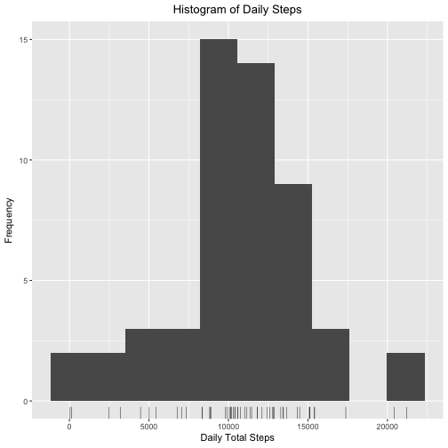
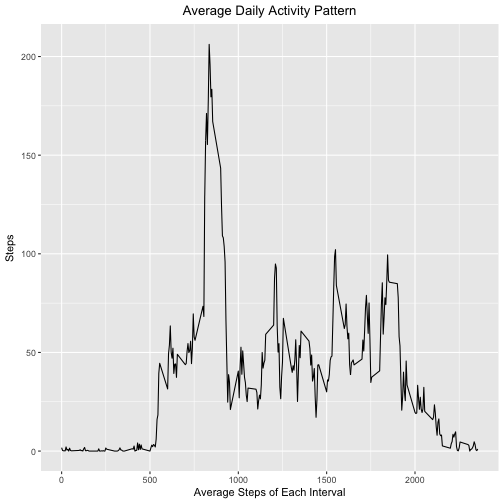
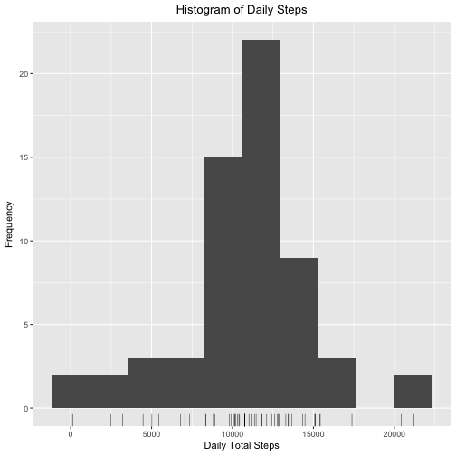
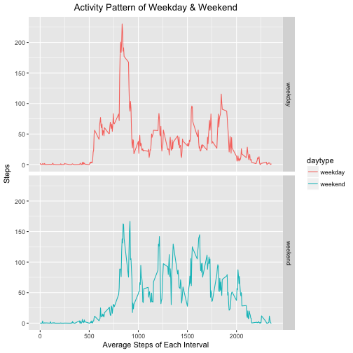

# Reproducible Research Assignment

### Set working environment

```r
rm(list=ls())
library(ggplot2)
setwd("~/Desktop/Data Science @Coursera/Assignments/5_2")
```
### Load & Preprocess the data
Download the data from website.

```r
if (!file.exists("activity.zip")){
      fileURL <- "https://d396qusza40orc.cloudfront.net/repdata%2Fdata%2Factivity.zip"
      download.file(fileURL, "activity.zip", method="curl")
}
unzip("activity.zip")
file.remove("activity.zip")
```

```
## [1] TRUE
```
Load and process the data. 

```r
dat <- read.csv("activity.csv",header = TRUE)
dat$steps <- as.numeric(dat$steps)
dat$date <- as.Date(dat$date,"%Y-%m-%d")
```
Reveiw the data when completed.

```r
str(dat)
```

```
## 'data.frame':	17568 obs. of  3 variables:
##  $ steps   : num  NA NA NA NA NA NA NA NA NA NA ...
##  $ date    : Date, format: "2012-10-01" "2012-10-01" ...
##  $ interval: int  0 5 10 15 20 25 30 35 40 45 ...
```

```r
head(dat)
```

```
##   steps       date interval
## 1    NA 2012-10-01        0
## 2    NA 2012-10-01        5
## 3    NA 2012-10-01       10
## 4    NA 2012-10-01       15
## 5    NA 2012-10-01       20
## 6    NA 2012-10-01       25
```
### What is mean total number of steps taken per day?
1.Calculate the total number of steps taken per day.

```r
dailystep <- aggregate(steps~date,dat,sum)
head(dailystep)
```

```
##         date steps
## 1 2012-10-02   126
## 2 2012-10-03 11352
## 3 2012-10-04 12116
## 4 2012-10-05 13294
## 5 2012-10-06 15420
## 6 2012-10-07 11015
```
2.Make a histogram of the total number of steps taken each day.

```r
qplot(steps,data = dailystep,bins=10) +
      geom_rug(size=0.2) +
      labs(x="Daily Total Steps",y="Frequency") +
      ggtitle("Histogram of Daily Steps") +
      theme(plot.title = element_text(hjust=0.5))
```



3.Calculate and report the mean and median of the total number of steps taken per day.

```r
summary(dailystep$steps)
```

```
##    Min. 1st Qu.  Median    Mean 3rd Qu.    Max. 
##      41    8841   10765   10766   13294   21194
```
### What is the average daily activity pattern?
1.Make a time series plot of the 5-minute interval and the average number of steps. 

```r
interstep <- aggregate(steps~interval,dat,mean)
ggplot(interstep,aes(interval,steps)) + 
      geom_line() +
      labs(x="Average Steps of Each Interval",y="Steps") +
      ggtitle("Average Daily Activity Pattern") +
      theme(plot.title = element_text(hjust=0.5))
```



2.Which 5-minute interval contains the maximum number of steps?

```r
interstep[which.max(interstep$steps),]
```

```
##     interval    steps
## 104      835 206.1698
```
### Imputing missing values
1.Calculate and report the total number of missing values in the dataset.
In the table below, "True"" means the value is missing.

```r
table(is.na(dat$steps))
```

```
## 
## FALSE  TRUE 
## 15264  2304
```
2.Filling in all of the missing values in the dataset.
Here, missing values are filled by mean of the 5-min interval steps into a new dataset.

```r
dat2 <- dat
for(i in 1:nrow(dat2)){
      if(is.na(dat2$steps[i])==TRUE){
            dat2$steps[i] = interstep$steps[which(interstep$interval==dat2$interval[i])]
      }
}

table(is.na(dat2$steps))
```

```
## 
## FALSE 
## 17568
```
3.Make a histogram.Calculate and report the mean and median total number of steps taken per day. 

```r
dailystep2 <- aggregate(steps~date,dat2,sum)
qplot(steps,data = dailystep2,bins=10) +
      geom_rug(size=0.2) +
      labs(x="Daily Total Steps",y="Frequency") +
      ggtitle("Histogram of Daily Steps") +
      theme(plot.title = element_text(hjust=0.5))
```



```r
summary(dailystep$steps)
```

```
##    Min. 1st Qu.  Median    Mean 3rd Qu.    Max. 
##      41    8841   10765   10766   13294   21194
```
We can see from the result, filling missing values make it a little bit different from the original statistic. After imputing missing data, the mean keeps the same, but the median change from 10765 to 10766.

### Are there differences in activity patterns between weekdays and weekends?
1.Create a new factor variable indicating weekday or weekend day.

```r
library(dplyr)
dat2 <- mutate(dat2,weekday = weekdays(date))
dat2 <- mutate(dat2,daytype = factor(weekday=="Saturday"|weekday=="Sunday",labels = c("weekday","weekend")))
```
2.Make a panel plot containing a time series plot of average nummber of steps for each 5-min interval for both weekday and weekend day.

```r
interstep2 <- aggregate(steps~interval+daytype,dat2,mean)
ggplot(interstep2,aes(interval,steps,color=daytype)) +
      geom_line() +
      facet_grid(daytype~.) +
      labs(x="Average Steps of Each Interval",y="Steps") +
      ggtitle("Activity Pattern of Weekday & Weekend") +
      theme(plot.title = element_text(hjust=0.5))
```


