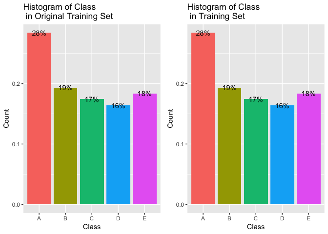
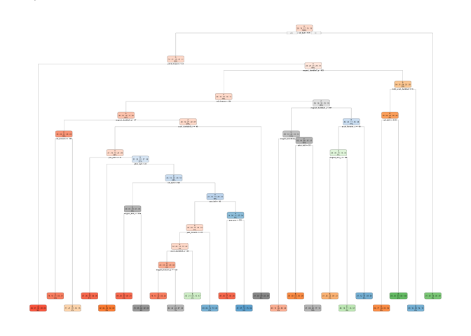

# Analysis of Prediction on Exercise Manner
### Assignment of Course *Practical Machine Learning*  
#### *Author: Yige Liu*
#### *Date: Jan. 18^th^, 2019*  
### Overview
The goal of this project is to predict the manner in which people did the exercise using data from accelerometers on the belt, forearm, arm, and dumbell of 6 participants.Six young health participants were asked to perform one set of 10 repetitions of the Unilateral Dumbbell Biceps Curl in five different fashions: 
```{}
- Class A: exactly according to the specification.  
- Class B: throwing the elbows to the front.  
- Class C: lifting the dumbbell only halfway.  
- Class D: lowering the dumbbell only halfway. 
- Class E: throwing the hips to the front.  
```

### Approach
1. Load the data set and briefly learn the characteristics of the data.  
2. Clean the data by excluding variables with little information.  
3. Split the data set into training set (70%) which is used to fit the model and testing set (30%) used to validate the model.  
4. Apply decision tree method to build a model and test the accuracy.  
5. Apply random forest method to build a model and test the accuracy.  
6. Select the model with highest accuracy.  
7. Apply the model to estimate the 20-observation testing dataset.  

### Preperation
First of all, set up the coding environment.

```r
setwd("~/Desktop/Data Science @Coursera/Assignments/8_4")
library(dplyr); library(caret); set.seed(111)
```
Then download the data and read in.

```r
if (!file.exists("training.csv")){
      download.file("https://d396qusza40orc.cloudfront.net/predmachlearn/pml-training.csv", 
                    "training.csv", method="curl")
}
Trainset <- read.csv("training.csv",header = TRUE,na.strings =c("NA","#DIV/0!"))

if (!file.exists("testing.csv")){
      download.file("https://d396qusza40orc.cloudfront.net/predmachlearn/pml-testing.csv", 
                    "testing.csv", method="curl")
}
Testset <- read.csv("testing.csv",header = TRUE,na.strings =c("NA","#DIV/0!"))
```
After browsing the data, clean up the data by excluding undesired variables.

```r
Trainset <- Trainset[,-c(1:7)]
Trainset <- Trainset[,-which(colMeans(is.na(Trainset))>0.8)]
Testset <- Testset[,-c(1:7)]
Testset <- Testset[,-which(colMeans(is.na(Testset))>0.8)]
sum(names(Trainset)!=names(Testset))
```

```
## [1] 1
```
There are total 19622 observations and 53 variables in the training set. Training data and Testing data are identical in variables except the classfication one. 

### Model & Validation
#### Split Dataset
Split the data set into training set (70%) which is used to fit the model and testing set (30%) used to validate the model.

```r
inTrain <- createDataPartition(y=Trainset$classe,p=0.7,list=FALSE)
training <- Trainset[inTrain,]
testing <- Trainset[-inTrain,]
```
After processing, the data for model training has 13737 observations.
Then simply explore the original training data and subsetting training data to see the distribution of class.  
<!-- -->

#### Decision Tree Method

```r
mod2 <- rpart::rpart(classe~.,data=training)
rpart.plot::rpart.plot(mod2)
```

<!-- -->

```r
pred2 <- predict(mod2,newdata=testing,type="class")
cfm2 <- confusionMatrix(pred2,testing$classe); cfm2
```

```
## Confusion Matrix and Statistics
## 
##           Reference
## Prediction    A    B    C    D    E
##          A 1540  175   19   49   46
##          B   52  644   91   91   78
##          C   34  107  813  145  106
##          D   20   96   75  602   73
##          E   28  117   28   77  779
## 
## Overall Statistics
##                                          
##                Accuracy : 0.7439         
##                  95% CI : (0.7326, 0.755)
##     No Information Rate : 0.2845         
##     P-Value [Acc > NIR] : < 2.2e-16      
##                                          
##                   Kappa : 0.6751         
##  Mcnemar's Test P-Value : < 2.2e-16      
## 
## Statistics by Class:
## 
##                      Class: A Class: B Class: C Class: D Class: E
## Sensitivity            0.9200   0.5654   0.7924   0.6245   0.7200
## Specificity            0.9314   0.9343   0.9193   0.9464   0.9479
## Pos Pred Value         0.8420   0.6736   0.6747   0.6952   0.7570
## Neg Pred Value         0.9670   0.8996   0.9545   0.9279   0.9376
## Prevalence             0.2845   0.1935   0.1743   0.1638   0.1839
## Detection Rate         0.2617   0.1094   0.1381   0.1023   0.1324
## Detection Prevalence   0.3108   0.1624   0.2048   0.1472   0.1749
## Balanced Accuracy      0.9257   0.7498   0.8559   0.7854   0.8340
```

```r
accuracy2 <- round(as.numeric(cfm2$overall[1]),digits=4) 
ose2 <- 1 - accuracy2 
```
The accuracy of this model is 74.39%. The expected out of sample error is 25.61%, which is quite high.

#### Random Forest Method

```r
mod4 <- randomForest::randomForest(classe ~. , data=training, method="class")
pred4 <- predict(mod4,newdata=testing,type="class")
cfm4 <- confusionMatrix(pred4,testing$classe); cfm4
```

```
## Confusion Matrix and Statistics
## 
##           Reference
## Prediction    A    B    C    D    E
##          A 1673    3    0    0    0
##          B    1 1126    2    0    0
##          C    0   10 1024   14    0
##          D    0    0    0  949    3
##          E    0    0    0    1 1079
## 
## Overall Statistics
##                                          
##                Accuracy : 0.9942         
##                  95% CI : (0.9919, 0.996)
##     No Information Rate : 0.2845         
##     P-Value [Acc > NIR] : < 2.2e-16      
##                                          
##                   Kappa : 0.9927         
##  Mcnemar's Test P-Value : NA             
## 
## Statistics by Class:
## 
##                      Class: A Class: B Class: C Class: D Class: E
## Sensitivity            0.9994   0.9886   0.9981   0.9844   0.9972
## Specificity            0.9993   0.9994   0.9951   0.9994   0.9998
## Pos Pred Value         0.9982   0.9973   0.9771   0.9968   0.9991
## Neg Pred Value         0.9998   0.9973   0.9996   0.9970   0.9994
## Prevalence             0.2845   0.1935   0.1743   0.1638   0.1839
## Detection Rate         0.2843   0.1913   0.1740   0.1613   0.1833
## Detection Prevalence   0.2848   0.1918   0.1781   0.1618   0.1835
## Balanced Accuracy      0.9993   0.9940   0.9966   0.9919   0.9985
```

```r
accuracy4 <- round(as.numeric(cfm4$overall[1]),digits=4) 
ose4 <- 1 - accuracy4
```
The accuracy of this model is 99.42%. The expected out of sample error is 0.58%.

### Conclusion
Random Forest algorithm has better accuracy. Thus the Random Forest is selected to predict the testing dataset.

### Prediction

```r
prediction <- predict(mod4,newdata=Testset,type="class")
prediction
```

```
##  1  2  3  4  5  6  7  8  9 10 11 12 13 14 15 16 17 18 19 20 
##  B  A  B  A  A  E  D  B  A  A  B  C  B  A  E  E  A  B  B  B 
## Levels: A B C D E
```

### Reference
Velloso, E.; Bulling, A.; Gellersen, H.; Ugulino, W.; Fuks, H. Qualitative Activity Recognition of Weight Lifting Exercises. Proceedings of 4th International Conference in Cooperation with SIGCHI (Augmented Human '13) . Stuttgart, Germany: ACM SIGCHI, 2013.
